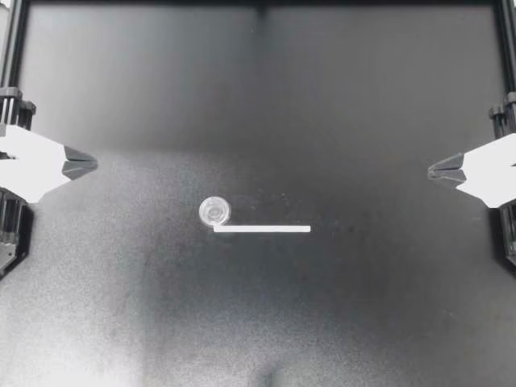
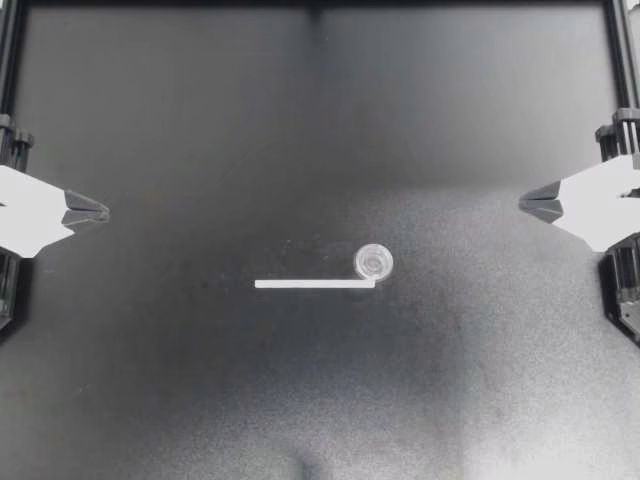
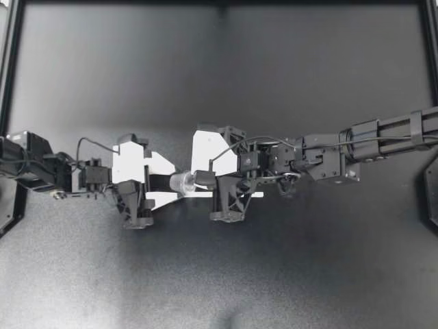
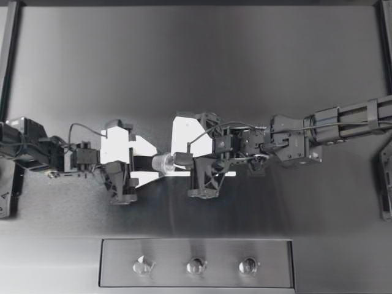

# RobotQ

Composable augmentation toolkit for LeRobot v3 datasets. Augments robotics training data with action-aware transforms and uploads to HuggingFace Hub.

**Live demo dataset:** [YongkangZOU/aloha-robotq-demo](https://huggingface.co/datasets/YongkangZOU/aloha-robotq-demo) — [Visualize](https://huggingface.co/spaces/lerobot/visualize_dataset?path=%2FYongkangZOU%2Faloha-robotq-demo%2Fepisode_0)

## What It Does

RobotQ takes a LeRobot v3 dataset, applies a composable pipeline of augmentations (visual, action-aware, and temporal), and outputs a new valid LeRobot v3 dataset on HuggingFace Hub.

**Key differentiator:** Unlike image-only augmentation tools, RobotQ understands that flipping a robot video horizontally requires also swapping left/right arm actions and negating mirror-sensitive joint axes. This is done through an adapter system that encodes robot-specific schema knowledge.

### Before / After

**Mirror augmentation** (flips video + swaps L/R arm actions):

| Before | After (Mirror + ColorJitter) |
|--------|------------------------------|
|  |  |

**BackgroundReplace** (SD Inpainting — "industrial kitchen"):

| Before | After |
|--------|-------|
|  |  |

### Available Augmentations

| Name | Type | What It Does |
|------|------|-------------|
| Mirror | RobotTransform | Flip video + swap L/R arm actions via adapter |
| ColorJitter | SequenceTransform | Brightness/contrast/saturation/hue (consistent per episode) |
| GaussianNoise | FrameTransform | Per-frame pixel noise |
| ActionNoise | TrajectoryTransform | Gaussian perturbation on action trajectories |
| SpeedWarp | TrajectoryTransform | Time-stretch episodes with interpolated actions |
| BackgroundReplace | TrajectoryTransform | SD Inpainting background replacement (optional, `fast` method only — SAM2 `auto` method not yet integrated) |

### Four Interfaces

- **CLI** — `robotq augment`, `robotq preview`, `robotq list`, `robotq adapters`
- **Python API** — `from robotq.core.pipeline import Compose`
- **MCP Server** — 6 tools: `augment_dataset`, `inspect_dataset`, `generate_config`, etc.
- **Claude Code Plugin** — 5 skills + MCP, install with `/plugin marketplace add inin-zou/QC`

**Interactive notebook:** [examples/demo.ipynb](examples/demo.ipynb) — full walkthrough with visualizations (runs on GitHub)

## How to Run

### Installation

```bash
git clone https://github.com/inin-zou/QC.git
cd QC
uv venv --python 3.12
uv pip install -e ".[dev]"
```

Login to HuggingFace (for uploading):
```bash
huggingface-cli login
```

### Quick Start (CLI)

```bash
# Augment with mirror + color jitter, upload to Hub
robotq augment \
  --dataset lerobot/aloha_static_cups_open \
  --output YOUR_USERNAME/aloha-augmented \
  --mirror --color-jitter \
  --adapter aloha \
  --multiply 2

# Preview before committing
robotq augment ... --dry-run

# Save before/after PNGs
robotq preview \
  --dataset lerobot/aloha_static_cups_open \
  --mirror --color-jitter --adapter aloha

# List available augmentations
robotq list
```

### Config File (for complex pipelines)

```bash
robotq augment --config examples/aloha_basic.yaml
```

```yaml
# examples/aloha_basic.yaml
dataset: lerobot/aloha_static_cups_open
adapter: aloha
output: YOUR_USERNAME/aloha-augmented
multiply: 2

pipeline:
  - type: Mirror
    p: 0.5
  - type: ColorJitter
    brightness: 0.3
    contrast: 0.2
    p: 1.0
```

### Python API

```python
from robotq.core.pipeline import Compose
from robotq.core.augmentations.color import ColorJitter
from robotq.core.augmentations.mirror import Mirror
from robotq.core.augmentations.speed import SpeedWarp
from robotq.adapters.aloha import AlohaAdapter
from robotq.io.loader import load_dataset
from robotq.io.writer import write_dataset

pipeline = Compose([
    Mirror(adapter=AlohaAdapter(), p=0.5),
    ColorJitter(brightness=0.2),
    SpeedWarp(min_rate=0.9, max_rate=1.1),
])

episodes = load_dataset("lerobot/aloha_static_cups_open", max_episodes=5)
augmented = [pipeline(ep) for ep in episodes]
write_dataset(episodes + augmented, repo_id="YOUR_USERNAME/aloha-augmented")
```

### MCP Server (for AI agents)

```bash
uv pip install -e ".[mcp]"
```

Exposes 6 tools that AI agents can call directly:

| Tool | What it does |
|------|-------------|
| `augment_dataset` | Run full augmentation pipeline and upload |
| `preview_augmentation` | Preview one augmentation on a single episode |
| `list_augmentations` | Show available transforms |
| `list_adapters` | Show available robot adapters |
| `inspect_dataset` | Inspect dataset structure (episodes, cameras, actions) |
| `generate_config` | Generate a YAML pipeline config with sensible defaults |

### Claude Code Plugin (Skills + MCP)

RobotQ is available as a Claude Code plugin marketplace. Install with:

```
/plugin marketplace add inin-zou/QC
/plugin install robotq@robotq
/reload-plugins
```

This registers **5 skills** and **6 MCP tools**:

| Skill | Trigger | What it does |
|-------|---------|-------------|
| `robotq:augment` | "augment this dataset" | Guide through augmentation pipeline |
| `robotq:preview` | "preview augmentation" | Quick before/after check |
| `robotq:configure` | "write a pipeline config" | Generate YAML config |
| `robotq:inspect` | "inspect this dataset" | Show dataset structure |
| `robotq:robotq` | "what can robotq do" | Overview and sub-skill router |

Skills provide natural language guidance (Claude follows instructions to run CLI commands). MCP tools provide direct function calls (Claude executes `augment_dataset()` with structured parameters). Both are installed together — the plugin bundles the MCP server automatically.

This follows the same pattern as [HuggingFace's dataset skills](https://github.com/huggingface/skills), making RobotQ a first-class citizen in the AI agent tooling ecosystem.

## Architecture

```
robotq/
├── core/                       # Engine layer
│   ├── episode.py              # Episode dataclass (universal data container)
│   ├── transform.py            # 4 base classes: Frame, Sequence, Trajectory, Robot
│   ├── pipeline.py             # Compose, OneOf, SomeOf (Albumentations-style)
│   ├── config.py               # YAML config -> pipeline builder
│   └── augmentations/          # Mirror, ColorJitter, Noise, SpeedWarp
├── io/                         # I/O layer
│   ├── loader.py               # LeRobot API + OpenCV video decoding
│   ├── writer.py               # LeRobot official writer (guarantees valid output)
│   └── video.py                # Pure MP4 decoder (decode only)
├── adapters/                   # Robot-specific knowledge
│   ├── base.py                 # ActionAdapter protocol
│   └── aloha.py                # ALOHA bimanual (14-DOF, L/R arm swap)
├── cli/main.py                 # Typer CLI (augment, preview, list, adapters)
├── mcp/server.py               # MCP server (6 tools for AI agents)
└── plugins/robotq/             # Claude Code plugin marketplace
    ├── commands/               # Slash commands (/robotq:augment, etc.)
    └── skills/                 # 5 skills (augment, preview, configure, inspect, overview)
```

**Tech stack:**
- Python 3.12+, uv, Typer + Rich, Polars, OpenCV, Ruff, pytest
- LeRobot v3 official API for dataset read/write
- Stable Diffusion Inpainting (`runwayml/stable-diffusion-inpainting` via diffusers) for BackgroundReplace — optional, requires `uv pip install -e ".[generative]"`

**Design choices:**
- **Episode is the universal container** — every transform takes and returns an Episode. No loose dicts.
- **4 transform base classes** — FrameTransform (per-frame random), SequenceTransform (temporally consistent), TrajectoryTransform (episode-level), RobotTransform (paired image+action via adapter).
- **LeRobot official writer** — we intentionally rely on `LeRobotDataset.create()` to guarantee output compatibility with the HF visualizer and training tools.
- **OpenCV for video decoding** — bypasses torchcodec FFmpeg dependency issues; frame-range seeking for efficiency.

## How AI Coding Agents Were Used

This project was built through structured AI agent orchestration using Claude Code. Rather than writing code in a single session, we designed a multi-phase system where a **coordinator** (the main Claude Code session) dispatches **specialized subagents** in parallel, each with isolated git worktrees, specific instructions, and test requirements.

### The Orchestration System

All agent coordination is defined in `.claude/docs/agentic-engineering.md` — a playbook with copy-pasteable agent dispatch blocks. The coordinator never writes code directly during parallel phases; it dispatches, validates, and integrates.

```
Coordinator (main session)
├── Reads design docs (product-design.md, architecture.md, design-patterns.md)
├── Dispatches subagents in parallel batches (each in a git worktree)
├── Runs validation gates between phases (pytest + import smoke tests)
├── Dispatches code-reviewer agents after each phase
└── Handles integration points manually (where multiple modules meet)
```

Each subagent receives:
- Full task description (what to implement, exact file paths, exact test specs)
- Context docs to read first (design-patterns.md for coding rules)
- A "done" criteria (tests must pass before reporting back)
- Isolation via git worktree (no conflicts with other parallel agents)

### Phase Breakdown

Before any code was written, a brainstorming phase produced 6 design documents (`.claude/docs/`): product design, architecture, design patterns, roadmap, agentic engineering playbook, and test guide.

**Phase 1 — Foundation (5 agents, 2 parallel batches):**

```
Batch 1A (3 agents simultaneously):
  Agent 1: core/episode.py + tests     ──┐
  Agent 2: io/video.py + tests          ──┼── validation gate ──┐
  Agent 3: io/schema.py + tests         ──┘                     │
                                                                 │
Batch 1B (2 agents simultaneously):                              │
  Agent 4: io/loader.py + tests         ──┐  (depends on 1A) ◄──┘
  Agent 5: io/writer.py + tests         ──┘
                                           │
Manual integration: transform.py + ColorJitter + DEMO 1 (real Hub upload)
```

**Phase 2 — Core Augmentations (4 agents, 1 batch + manual):**

```
Batch 2A (3 agents simultaneously):
  Agent 6: augmentations/noise.py + tests
  Agent 7: adapters/base.py + aloha.py + tests
  Agent 8: core/pipeline.py + tests

Manual: augmentations/mirror.py (critical integration — adapter + transform + video)
        DEMO 2: Mirror + ColorJitter pipeline on real aloha data
```

**Phase 3 — CLI & Polish (3 agents simultaneously):**

```
  Agent 9:  cli/main.py (Typer + Rich)
  Agent 10: core/config.py + examples/aloha_basic.yaml
  Agent 11: README.md
```

**Phase 4 — Stretch Goals (2 agents simultaneously):**

```
  Agent 12: augmentations/speed.py (SpeedWarp)
  Agent 13: mcp/server.py (MCP server for AI agents)
```

### Quality Gates

Between every phase:
1. **Full test suite** — `pytest tests/unit/ -v` must pass (started at 29, grew to 141)
2. **Import smoke test** — verify all modules import without error
3. **Code review agent** — dedicated reviewer checks against design-patterns.md
4. **Demo checkpoint** — real aloha dataset loaded, augmented, written, and (at phase boundaries) pushed to Hub

The error handling review alone found 8 issues (3 critical: silent frame padding, missing 0-episode guard, IndexError on empty frames). All fixed before proceeding.

### What the Agentic Workflow Caught

1. **LeRobot v3.0 format mismatch** — initial research said per-episode files, but real datasets pack all episodes into single chunk files. Discovered during Phase 1C integration when the loader hit the real data. Entire loader rewritten from scratch.
2. **torchcodec FFmpeg dependency** — LeRobot's default video decoder crashed on macOS. Switched to OpenCV with frame-range seeking.
3. **push_to_hub API difference** — method lives on `LeRobotDataset`, not `LeRobotDatasetMetadata`. Found during real Hub upload test.
4. **Silent data corruption** — code-reviewer agent flagged the loader silently padding frames when video/parquet counts disagreed. Changed to warning + hard error on zero frames.

### Stats
- **15+ agent dispatches** across 4 phases
- **128 unit tests** written by agents + manual integration
- **~2,500 lines of source code** + ~1,700 lines of tests
- **6 design documents** written before any code — agents followed the spec
- Design docs and agent playbook available in `.claude/docs/`

## Jupyter Notebook Demo

See [examples/demo.ipynb](examples/demo.ipynb) for an interactive walkthrough that:
- Loads a real ALOHA dataset and inspects episode structure
- Builds a composable pipeline (Mirror + ColorJitter + SpeedWarp)
- Shows before/after frame comparison grids
- Plots action trajectories showing L/R arm swap
- Writes the augmented dataset

The notebook includes pre-executed outputs — viewable directly on GitHub without running anything.

## Testing

```bash
# Run all unit tests
uv run pytest tests/unit/ -v

# Quick smoke test
robotq list
robotq augment --dataset lerobot/aloha_static_cups_open --output test/smoke \
  --color-jitter --adapter aloha --max-episodes 1 --no-upload --dry-run
```

128 tests covering: Episode validation, video decoding, all 6 augmentations, pipeline composition, adapter arm-swap logic, config parsing, writer integrity checks, MCP server tools, loader integration.

## Known Limitations

- **BackgroundReplace mask quality** — The `fast` method uses frame differencing, which produces rough masks. Works for proving the pipeline, but SAM2 segmentation would produce much cleaner robot/background separation.
- **Single robot adapter** — Only ALOHA (bimanual, 14-DOF) is implemented. The adapter pattern is extensible but unproven with other robot types (single-arm, mobile manipulators).
- **Memory usage** — All episode frames are held in RAM. Loading 5 episodes × 4 cameras × 400 frames ≈ 7GB. Large datasets (50+ episodes) may OOM — consider using `--max-episodes` to limit.
- **No resume on failure** — If Hub upload fails partway, there's no checkpointing. The full augmentation + write must be re-run.
- **BackgroundReplace processes one camera** — Inpainting runs on the primary camera by default. Processing all 4 cameras is supported but 4x slower (~10s per keyframe × 4 cameras).

## Roadmap

- Episode-level parallelism — process multiple episodes concurrently
- SAM2 integration — accurate foreground segmentation for BackgroundReplace
- Rust kernels — PyO3 acceleration for frame processing hot loops
- More robot adapters — single-arm, mobile manipulators
- Training integration — direct use as a LeRobot training-time transform
